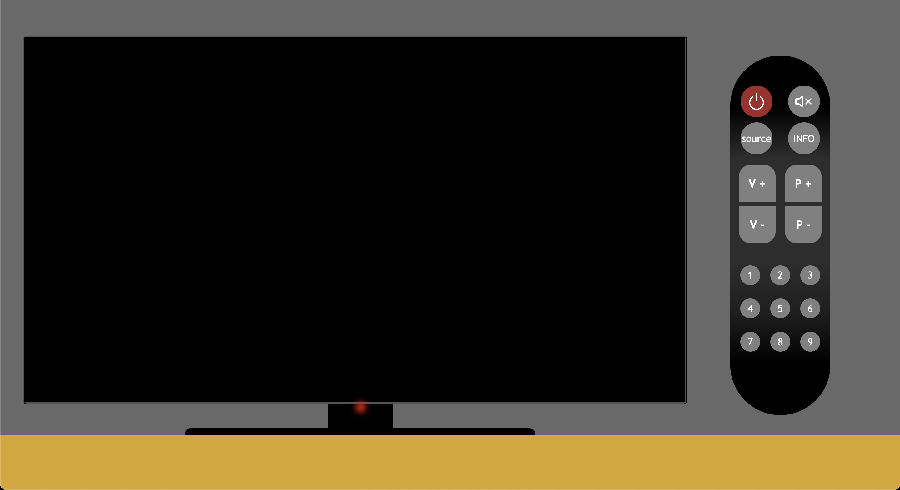
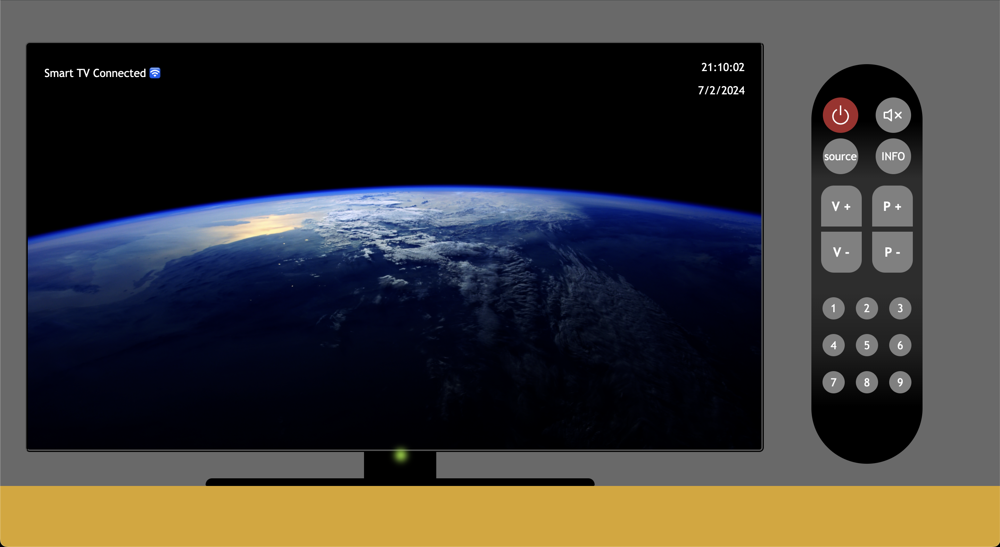
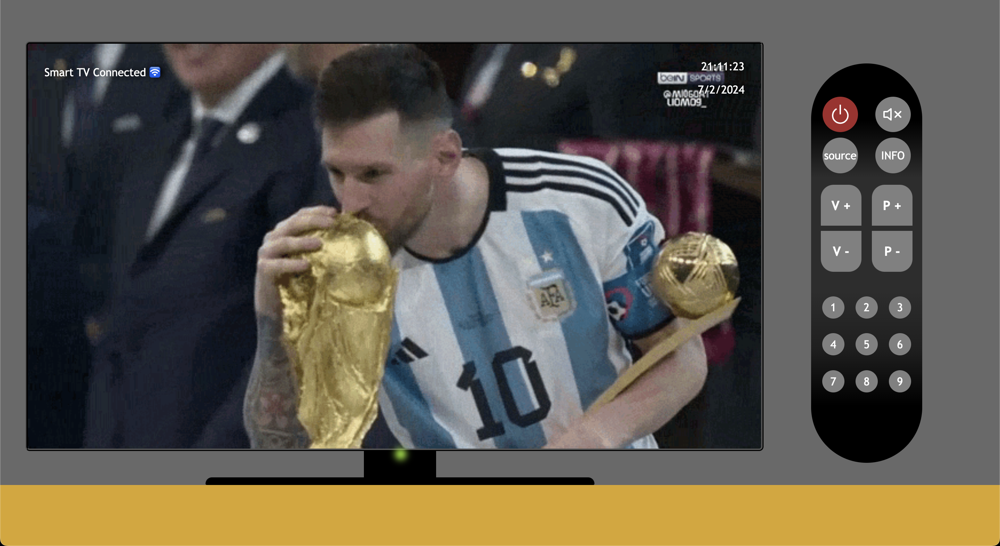
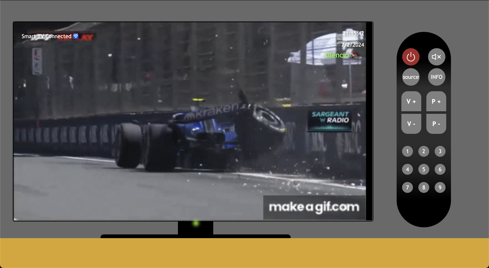
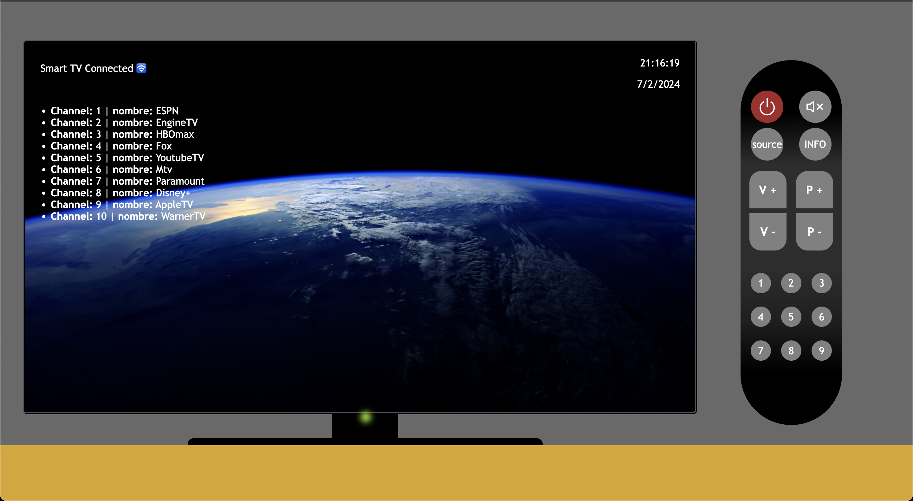

# SMART TV APP

This is the second Project of the Full Stack Development Bootcamp with Geekshubs Academy. Based only on HTML, CSS and JAVASCRIPT.

<details>
  <summary>Content 📝</summary>
  <ol>
    <li><a href="#objetive-🎯 ">Objetive</a></li>
    <li><a href="#about-a-project-🔎-🔎">About a project</a></li>
    <li><a href="#deploy-🚀">Deploy</a></li>
    <li><a href="#stack">Stack</a></li>
    <li><a href="#view">View</a></li>
    <li><a href="#contributions">Contributions</a></li>
    <li><a href="#license">Licence</a></li>
    <li><a href="#webgraphy">Webgraphy</a></li>
    <li><a href="#development">Development</a></li>
    <li><a href="#acknowledgments">Acknowledgments</a></li>
    <li><a href="#contact">Contact</a></li>
  </ol>
</details>

## Objetive 🎯

Simulated smart tv with gif images, channel, volume and source functions.

## About a project 🔎

It is a simple web page thats simulates a smart tv. Remote control has been created with css layout.

## Deploy 🚀

<div align="center">
    <a href="https://ramer8.github.io/tvInteractiva/"><strong>Url a producción </strong></a>🚀🚀🚀
</div>

## Stack

<div align="center">

<div align="center">
<a href="https://developer.mozilla.org/es/docs/Web/HTML">
    
</a>
<a href="https://developer.mozilla.org/es/docs/Web/CSS">
    
</a>
<a href="https://www.github.com/">
    
</a>
 </div>

## View

Landing/Home
  
Power on

Channel up function

Mute function

Hdmi + volume up function

Channel List function


Coding process:

Is a tv smart with his default functions, numeric volume up & down, mute function, channel up & down, channel info and source to connect other devices.

It was been coding in one html file, one js to do the function and one css file to layout

It was made in three files, index.html, main.js to make the functions and styles.css file for layout. I used gif images. The project has no sound and the design is not responsive.
The channel number is shown on the screen when the buttons are pressed to change channels. When pressing the volume up and volume down button shown the numeric value on the screen
I have used many functions to perform different tasks.
None of the buttons work when the TV is off.
It have a led light to show when the tv is on. Is red when is power off, and green when it working.

## Contributions

Suggestions and contributions are always welcome.

You can do it in two ways:

1.Opening an issue
2.Create a fork of the repository

- Createa a new branch
  ```
  $ git checkout -b feature/userName-improvement
  ```
- Make a commit with your changes
  ```
  $ git commit -m 'feat: better thing by'
  ```
- Push the branch
  ```
  $ git push origin feature/userName-improvement
  ```
- Open a Pull Request

## License

This project is under license by Ramiro Poblete

## Webgraphy:

To achieve my goal I have collected information from:

- https://developer.mozilla.org/es/

## Development:

```js
const developer = "Ramiro Poblete"

console.log("Developed by: Ramiro Poblete + GeekHub")
```

## Contact

<a href = "mailto:ramirolpoblete@gmail.com"></a>
<a href="https://www.linkedin.com/in/ramiropoblete/" target="_blank"></a>
<a href = "https://github.com/Ramer8"></a>

</p>
